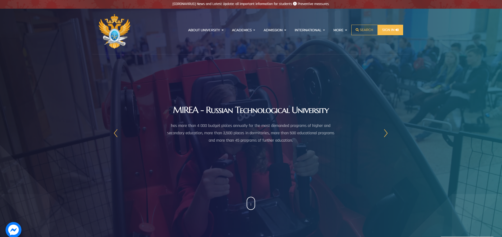
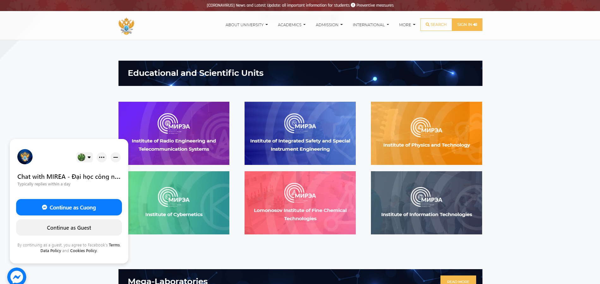
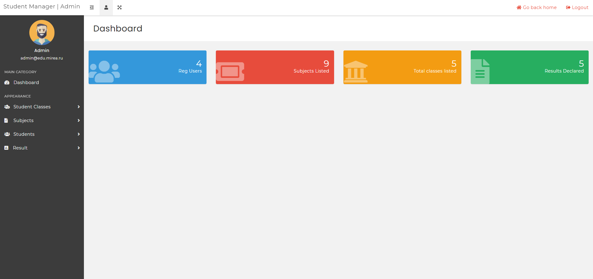
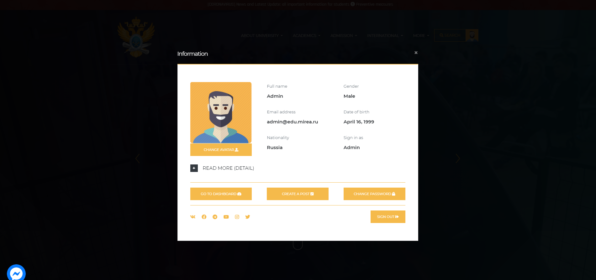
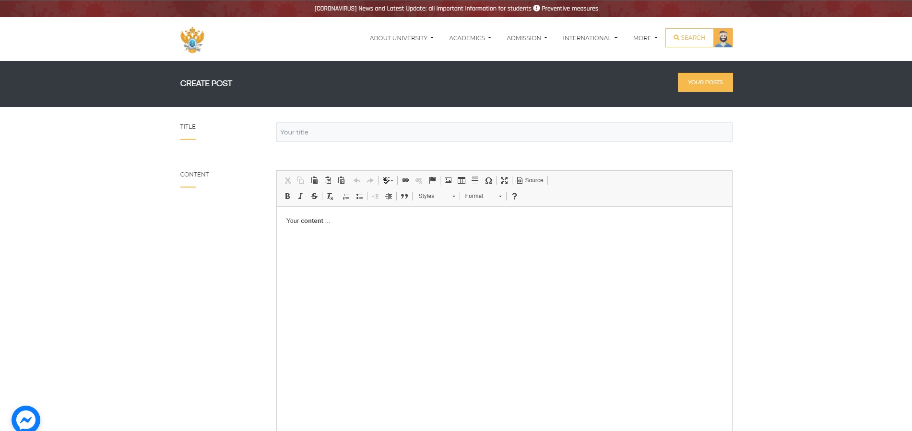
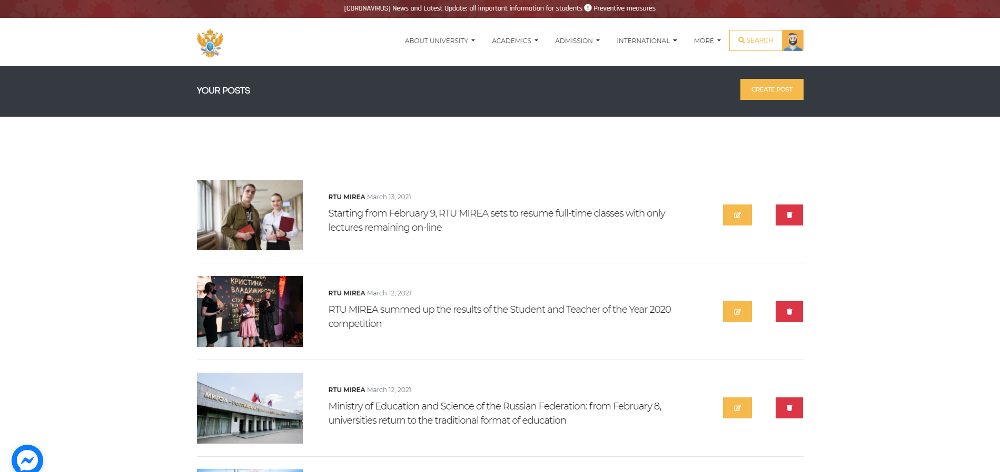
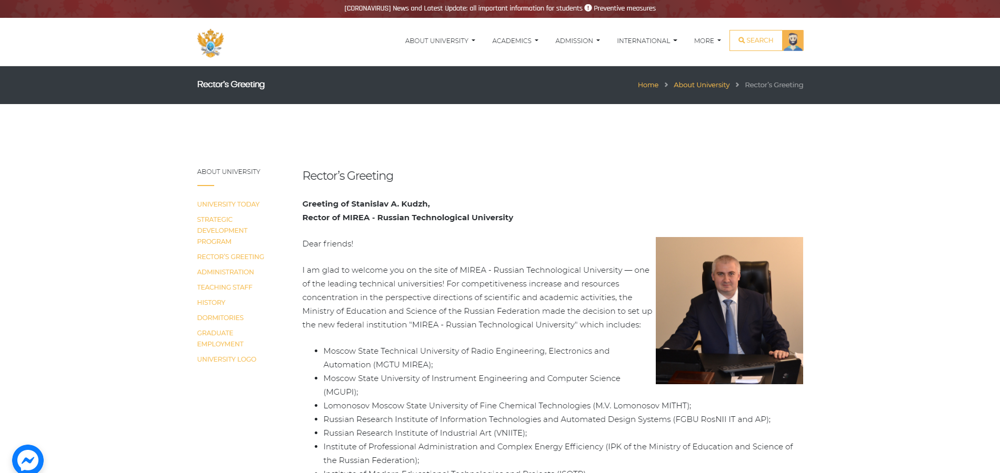
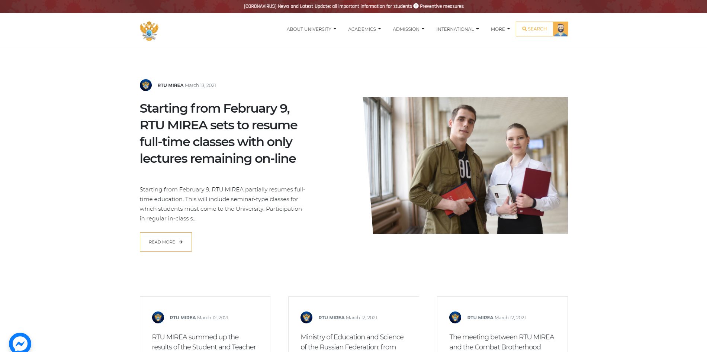
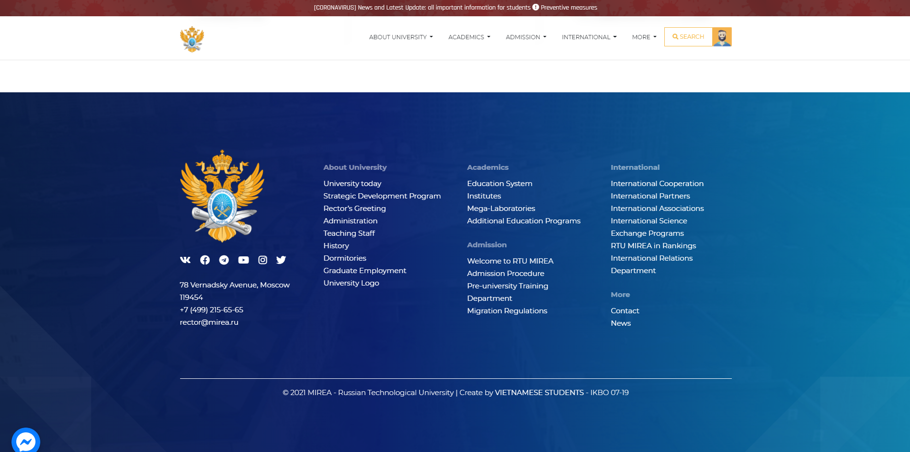

<!-- PROJECT LOGO -->
 

  

  <h3 align="center">WEB PROJECT</h3>

  

    MIREA - RUSSIAN TECHNOLOGICAL UNIVERSITY
     
    <a href="http://mireaweb.dinhcuong.me/"><strong>View our website »</strong></a>
     
     
  

<!-- ABOUT THE PROJECT -->

## About The Project

   
  
   
   

<strong>MIREAWEB</strong> is a one-month development project focusing on building an educational website. This is a small project in the subject <i>Технология разработки программных приложений</i> at the university. The project is implemented by a group of Vietnamese students studying at <i>RUSSIAN TECHNOLOGICAL UNIVERSITY</i>. Website is an english version of <i>[mirea.ru](https://mirea.ru)</i> with redesigned interface and functionality. We build a website with the ability to optimize the user interface space, bring a modern and intuitive interface, and convenient functions for user interaction.

### Access modes with login

- Student/Teacher
- Editor
- Admin

### Functions without login

- Check information about university
- Read the latest university news

### Functions with login

- Check information about university
- Read the latest university news
- [For all user] Change avatar, password
- [Only for student] Check learning results
- [Only for editor] Add, edit or delete posts
- [Only for admin] Access dashboard, manage information about students, groups, disciplines and subjects

### Languages used

- PHP
- HTML/CSS/Javascript

### Vendors used

- [Bootstrap](https://getbootstrap.com)
- [JQuery](https://jquery.com)
- [CKEditor](https://ckeditor.com)
- [FontAwesome](https://fontawesome.com)
- [Flickity](https://flickity.metafizzy.co)
- [Toastify](https://apvarun.github.io/toastify-js)
- [GoogleFont](https://fonts.google.com/)
- [GoogleMapAPI](https://developers.google.com/maps/documentation/javascript/overview)
- [FacebookAPI](https://developers.facebook.com)

<!-- GETTING STARTED -->

## Recommendations

Website is only optimized on desktop platforms. Please use the desktop when accessing the website.
For the best experience, we recommend using the following chromium browsers:

- Microsoft Edge
- Chrome

## Usage

Log in with the demo accounts available to take full advantage of the features.

### Demo accounts:

- [For student] Email: le.d@edu.mirea.ru | Password: 123456789
- [For editor] Email: editor@edu.mirea.ru | Password: 123456789
- [For admin] Email: admin@edu.mirea.ru | Password: 123456789

### Demo screenshots

   
  
   

   
  
   

   
  
   

   
  
   

   
  
   

   
  
   

   
  
   

   
  
   

 

<!-- CONTACT -->

## Teamwork

1. MAIN PAGE - LE DINH CUONG [github@ledhcg](https://github.com/ledhcg)
2. ADMIN PAGE - VU XUAN CANH [github@xuancanhit99](https://github.com/xuancanhit99)
3. CONTENT - NGUYEN XUAN BACH [github@nekokami99](https://github.com/nekokami99)
4. CONTENT - CAO DUC MANH [github@macmie2411999](https://github.com/macmie2411999)

<!-- ACKNOWLEDGEMENTS -->

## Acknowledgements

- [000webhost](https://www.000webhost.com)
- [GoDaddy](https://godaddy.com/)
- [dinhcuong.me](https://dinhcuong.me/)
